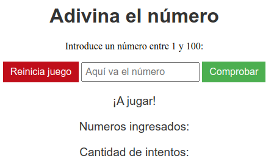
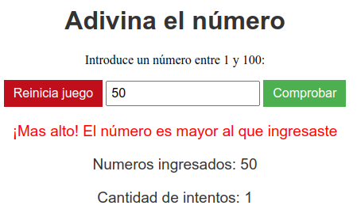
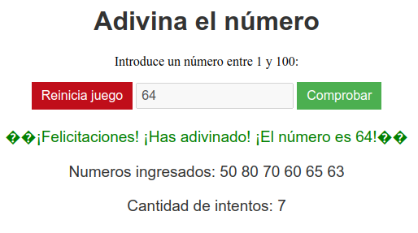

# Descripción del Repositorio
- Este repositorio contiene un pequeño juego para adivinar un número (seleccionado aleatoriamente por el programa) entre 1 a 100. Se introduce el número en la casilla correspondiente, se da
clic en el boton comprobar y el programa nos indica si el número insertado esta por debajo o por encima del que ha seleccionado previamanete, la cantidad de intentos es ilimitada hasta que se
logre acertar con el número, tambien se muestran los números ingresados, la cantidad de intentos y un boton para reiniciar el juego.
- Para la realizacion de este proyecto se utilizaron las siguientes tecnologias:
  - [Html](https://developer.mozilla.org/es/docs/Web/HTML): Lenguaje de marcado para esrtuctura basica del proyecto en la web.
  - [Css](https://developer.mozilla.org/es/docs/Web/CSS): Lenguaje de estilos para dar presentacion al proyecto web.
  - [Javascript](https://developer.mozilla.org/es/docs/Web/javascript): Lenguaje de programación para desarrollo de forntend y Backend.

## Imagenes del juego
- Imagen 1

- Imagen 2

- Imagen 3

